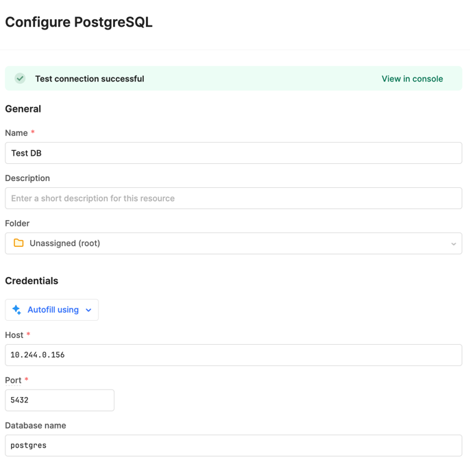
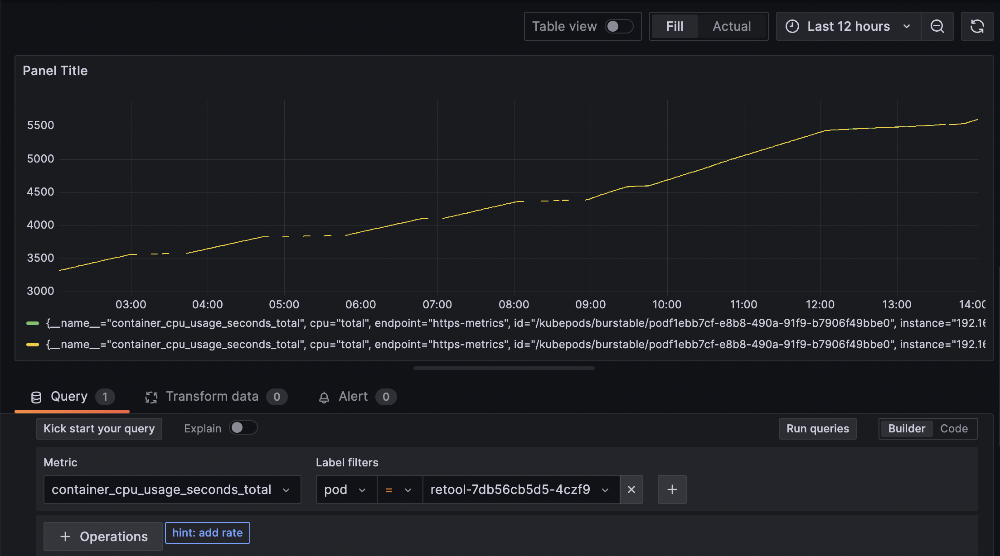

# Task 1
In order to provision local kubernetes cluster Minikube was used. Minikube is a lightweight Kubernetes implementation that creates a VM on your local machine and deploys a simple cluster containing only one node. It works well for the purpose of testing.

To start minikube the following command was executed:

`minikube start -p swissborg`

Next step was creating Terraform manifest `terraform/providers.tf` and running `terraform init` to initialize kubernetes provider with specified params.

Resources used:
https://medium.com/rahasak/terraform-kubernetes-integration-with-minikube-334c43151931

# Task 2

In order to install argocd three steps were performed:

1. Define `helm` provider in `terraform/provider.tf`
2. Add initial application definition in `argocd/application.yaml`
3. Define ArgoCD installation in `terraform/argo.tf`. It uses helm to install argocd and specifies `argocd/application.yaml` as values file

Resources used: https://piotrminkowski.com/2022/06/28/manage-kubernetes-cluster-with-terraform-and-argo-cd/

# Task 3 

To install traefik in cluster with argocd `argocd/traefik.yaml` which after applying creates argocd application with inflated helm chart taken from `source:`

Resources used:
* https://argo-cd.readthedocs.io/en/stable/user-guide/helm/
* https://doc.traefik.io/traefik/getting-started/install-traefik/#use-the-helm-chart

# Task 4

Keycloak was installed to the cluster by applying `argocd/keycloak.yaml`. Helm parameters were specified to set default username and password for admin.

After installing, I ran `kubectl port-forward svc/keycloak-http 8080:80 -n identity` to access keycloak admin console in the browser and verify that it's working properly.

Resources used:
https://www.keycloak.org/getting-started/getting-started-kube

# Task 5

To deploy postgresql to the cluster I applied argocd configuration in `argocd/postgresql.yaml` which uses `postgresql` helm chart from https://charts.bitnami.com/bitnami.
This chart provides PVC for data storage which ensures that data persists across pod restarts and deployments, and integrates well with dynamic volume provisioning in Kubernetes.

# Task 6

As a starting point for deploying Retool application I took this official guide https://docs.retool.com/self-hosted/quickstarts/kubernetes/helm.

This is where a need for introducing secrets management appeared since private keys need to be defined for retool deployment. There are multiple ways how secrets can be handled in scope of argocd deployment (https://argo-cd.readthedocs.io/en/stable/operator-manual/secret-management/), but in scope of the challenge and considering that retool helm chart provides a convenient way to use opaque k8s secrets, I decided to go with them. Secrets setup was done as described in k8s documentation (https://kubernetes.io/docs/tasks/configmap-secret/managing-secret-using-config-file/), applied `retool-secret.yaml` (it was edited with placeholder values to safely add it to VCS) manifest with kubectl and specified them in helm values in argocd application manifest. I also disabled workflows, code executor and chart's ingress as those are not needed in scope of the task and set replicas to 1 to save on the resources (default value of 2 caused overconsumption of RAM and made cluster unstable).

After deployment was set up I managed to access retool application and added postgresql db deployed previously as resource by accessing it via cluster IP.

This allows to add the datasource to retool application and therefore use it as frontend for postgresql.

# Task 7

For this task I decided to go with `kube-prometheus-stack` helm chart. It includes Prometheus, Grafana, Alertmanager, node-exporter, kube-state-metrics and an adapter for Kubernetes Metrics API-s which allows for easy and configurable monitoring of cluster resources. To install the chart in the cluster I created argocd manifest in `argocd/prometheus.yaml`, set `podMonitorSelectorNilUsesHelmValues` and `serviceMonitorSelectorNilUsesHelmValues` values to false so that Prometheus to pick up all the Pod and Service monitoring across the cluster.
After applying the manifest I am able to login to grafana with the default admin credentials (password can be configured in helm values, but I am using the default one). When creating dashboard in grafana I can choose Prometheus (which is deployed as part of the stack) as a data source which scrapes information about cluster objects and create visualizations based on that.

